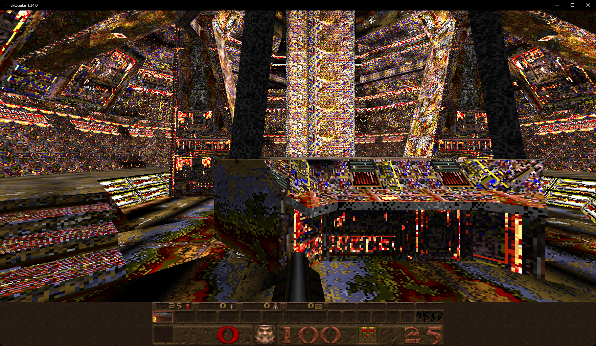
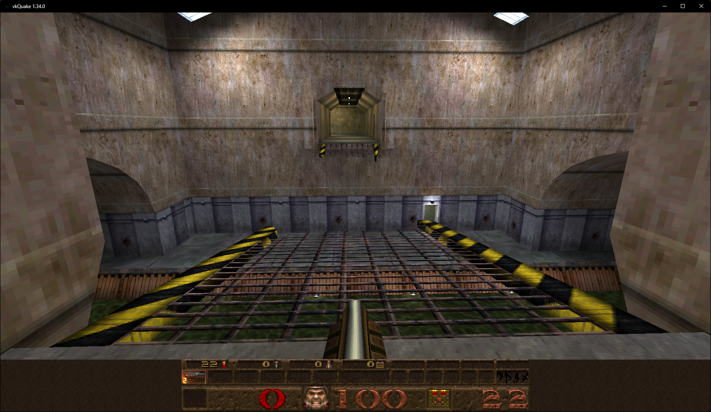
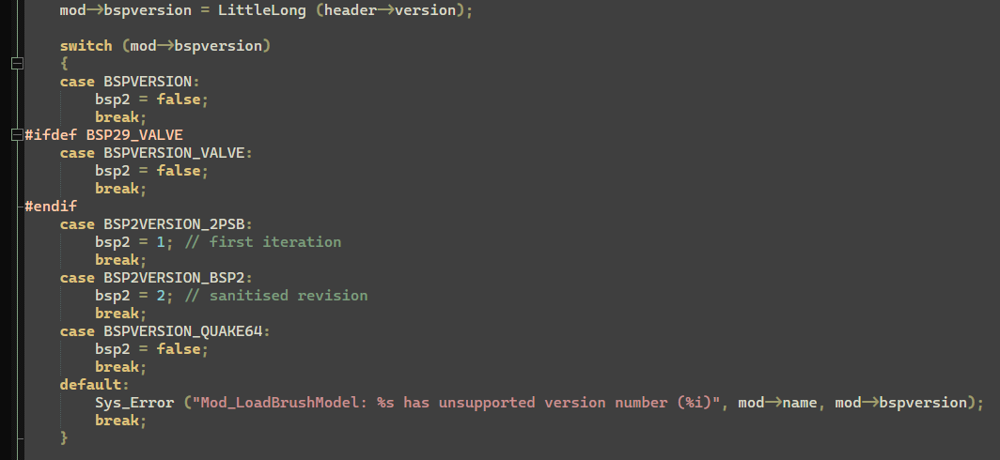
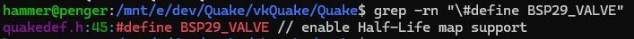
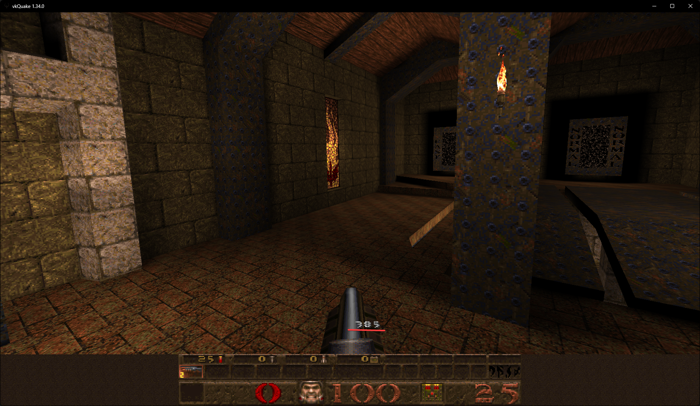

# Fucking around with (vk)Quake

A few days ago I was trying to do some stuff with vkQuake, and I saw a [video about loading HLAlpha0.52 bsp files in DOS Quake](https://www.youtube.com/watch?v=V2rScffUWG0), so I decided to try it myself.

Clearly, I got the same result as in the video (minus the soundtrack, thank god).

But I also wanted to see what would happen if I loaded a retail HL BSP in. And it worked, somehow...

At first I thought "this works because the version checker fails, somehow", but after looking into the source code, I realized that it does not fail.

So it dosen't fail, okay, "but where is BSP29_VALVE defined?", I asked. One grep later I found out that it is defined in quakedef.h

## Other stuff

I also tried to implement bunnyjumping (failed at that), and a very, very bad spedometer

I could've just used a source port that has both, but I didn't, because why should I?

<small>Written on 2026-02-20</small>